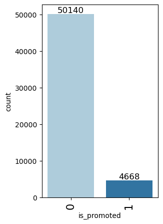

## Problem Statement

### Business context

Employee Promotion means the ascension of an employee to higher ranks, this aspect of the job is what drives employees the most. The ultimate reward for dedication and loyalty towards an organization and the HR team plays an important role in handling all these promotion tasks based on ratings and other attributes available.

The HR team in JMD company stored data on the promotion cycle last year, which consists of details of all the employees in the company working last year and also if they got promoted or not, but every time this process gets delayed due to so many details available for each employee - it gets difficult to compare and decide.


### Objective

For the upcoming appraisal cycle, the HR team wants to utilize the stored data and leverage machine learning to make a model that will predict if a person is eligible for promotion or not. You, as a data scientist at JMD company, need to come up with the best possible model that will help the HR team to predict if a person is eligible for promotion or not.


### Data Description

- employee_id: Unique ID for the employee
- department: Department of employee
- region: Region of employment (unordered)
- education: Education Level
- gender: Gender of Employee
- recruitment_channel: Channel of recruitment for employee
- no_ of_ trainings: no of other training completed in the previous year on soft skills, technical skills, etc.
- age: Age of Employee
- previous_ year_ rating: Employee Rating for the previous year
- length_ of_ service: Length of service in years
- awards_ won: if awards won during the previous year then 1 else 0
- avg_ training_ score: Average score in current training evaluations
- is_promoted: (Target) Recommended for promotion

## **Please read the instructions carefully before starting the project.** 
This is a commented Jupyter IPython Notebook file in which all the instructions and tasks to be performed are mentioned. 
* Blanks '_______' are provided in the notebook that 
needs to be filled with an appropriate code to get the correct result. With every '_______' blank, there is a comment that briefly describes what needs to be filled in the blank space. 
* Identify the task to be performed correctly, and only then proceed to write the required code.
* Fill the code wherever asked by the commented lines like "# write your code here" or "# complete the code". Running incomplete code may throw error.
* Please run the codes in a sequential manner from the beginning to avoid any unnecessary errors.
* Add the results/observations (wherever mentioned) derived from the analysis in the presentation and submit the same.


## Importing necessary libraries


```python
# This will help in making the Python code more structured automatically (good coding practice)
# %load_ext nb_black

# Libraries to help with reading and manipulating data
import pandas as pd
import numpy as np

# Libaries to help with data visualization
import matplotlib.pyplot as plt
import seaborn as sns

# To tune model, get different metric scores, and split data
from sklearn.metrics import (
    f1_score,
    accuracy_score,
    recall_score,
    precision_score,
    confusion_matrix,
    roc_auc_score,
    plot_confusion_matrix,
)
from sklearn.model_selection import train_test_split, StratifiedKFold, cross_val_score

# To be used for data scaling and one hot encoding
from sklearn.preprocessing import StandardScaler, MinMaxScaler, OneHotEncoder

# To oversample and undersample data
from imblearn.over_sampling import SMOTE
from imblearn.under_sampling import RandomUnderSampler

# To do hyperparameter tuning
from sklearn.model_selection import RandomizedSearchCV

# To impute missing values
from sklearn.impute import SimpleImputer

# To be used for creating pipelines and personalizing them
from sklearn.pipeline import Pipeline
from sklearn.compose import ColumnTransformer

# To define maximum number of columns to be displayed in a dataframe
pd.set_option("display.max_columns", None)

# To supress scientific notations for a dataframe
pd.set_option("display.float_format", lambda x: "%.3f" % x)

# To help with model building
from sklearn.linear_model import LogisticRegression
from sklearn.tree import DecisionTreeClassifier
from sklearn.ensemble import (
    AdaBoostClassifier,
    GradientBoostingClassifier,
    RandomForestClassifier,
    BaggingClassifier,
)
from xgboost import XGBClassifier

# To suppress scientific notations
pd.set_option("display.float_format", lambda x: "%.3f" % x)

# To supress warnings
import warnings

warnings.filterwarnings("ignore")
```

## Loading the dataset


```python
promotion = pd.read_csv("employee_promotion.csv")
```

## Data Overview

The initial steps to get an overview of any dataset is to: 
- observe the first few rows of the dataset, to check whether the dataset has been loaded properly or not
- get information about the number of rows and columns in the dataset
- find out the data types of the columns to ensure that data is stored in the preferred format and the value of each property is as expected.
- check the statistical summary of the dataset to get an overview of the numerical columns of the data

### Checking the shape of the dataset


```python
# Checking the number of rows and columns in the training data
promotion.shape #mplete the code to view dimensions of the train data
```


    (54808, 13)


```python
# let's create a copy of the data
data = promotion.copy()
```

### Displaying the first few rows of the dataset


```python
# let's view the first 5 rows of the data
data.head() ##  Complete the code to view top 5 rows of the data
```


<div>
<style scoped>
    .dataframe tbody tr th:only-of-type {
        vertical-align: middle;
    }

    .dataframe tbody tr th {
        vertical-align: top;
    }

    .dataframe thead th {
        text-align: right;
    }
</style>
<table border="1" class="dataframe">
  <thead>
    <tr style="text-align: right;">
      <th></th>
      <th>employee_id</th>
      <th>department</th>
      <th>region</th>
      <th>education</th>
      <th>gender</th>
      <th>recruitment_channel</th>
      <th>no_of_trainings</th>
      <th>age</th>
      <th>previous_year_rating</th>
      <th>length_of_service</th>
      <th>awards_won</th>
      <th>avg_training_score</th>
      <th>is_promoted</th>
    </tr>
  </thead>
  <tbody>
    <tr>
      <th>0</th>
      <td>65438</td>
      <td>Sales &amp; Marketing</td>
      <td>region_7</td>
      <td>Master's &amp; above</td>
      <td>f</td>
      <td>sourcing</td>
      <td>1</td>
      <td>35</td>
      <td>5.000</td>
      <td>8</td>
      <td>0</td>
      <td>49.000</td>
      <td>0</td>
    </tr>
    <tr>
      <th>1</th>
      <td>65141</td>
      <td>Operations</td>
      <td>region_22</td>
      <td>Bachelor's</td>
      <td>m</td>
      <td>other</td>
      <td>1</td>
      <td>30</td>
      <td>5.000</td>
      <td>4</td>
      <td>0</td>
      <td>60.000</td>
      <td>0</td>
    </tr>
    <tr>
      <th>2</th>
      <td>7513</td>
      <td>Sales &amp; Marketing</td>
      <td>region_19</td>
      <td>Bachelor's</td>
      <td>m</td>
      <td>sourcing</td>
      <td>1</td>
      <td>34</td>
      <td>3.000</td>
      <td>7</td>
      <td>0</td>
      <td>50.000</td>
      <td>0</td>
    </tr>
    <tr>
      <th>3</th>
      <td>2542</td>
      <td>Sales &amp; Marketing</td>
      <td>region_23</td>
      <td>Bachelor's</td>
      <td>m</td>
      <td>other</td>
      <td>2</td>
      <td>39</td>
      <td>1.000</td>
      <td>10</td>
      <td>0</td>
      <td>50.000</td>
      <td>0</td>
    </tr>
    <tr>
      <th>4</th>
      <td>48945</td>
      <td>Technology</td>
      <td>region_26</td>
      <td>Bachelor's</td>
      <td>m</td>
      <td>other</td>
      <td>1</td>
      <td>45</td>
      <td>3.000</td>
      <td>2</td>
      <td>0</td>
      <td>73.000</td>
      <td>0</td>
    </tr>
  </tbody>
</table>
</div>


```python
# let's view the last 5 rows of the data
data.tail() ##  Complete the code to view last 5 rows of the data  
```


<div>
<style scoped>
    .dataframe tbody tr th:only-of-type {
        vertical-align: middle;
    }

    .dataframe tbody tr th {
        vertical-align: top;
    }

    .dataframe thead th {
        text-align: right;
    }
</style>
<table border="1" class="dataframe">
  <thead>
    <tr style="text-align: right;">
      <th></th>
      <th>employee_id</th>
      <th>department</th>
      <th>region</th>
      <th>education</th>
      <th>gender</th>
      <th>recruitment_channel</th>
      <th>no_of_trainings</th>
      <th>age</th>
      <th>previous_year_rating</th>
      <th>length_of_service</th>
      <th>awards_won</th>
      <th>avg_training_score</th>
      <th>is_promoted</th>
    </tr>
  </thead>
  <tbody>
    <tr>
      <th>54803</th>
      <td>3030</td>
      <td>Technology</td>
      <td>region_14</td>
      <td>Bachelor's</td>
      <td>m</td>
      <td>sourcing</td>
      <td>1</td>
      <td>48</td>
      <td>3.000</td>
      <td>17</td>
      <td>0</td>
      <td>78.000</td>
      <td>0</td>
    </tr>
    <tr>
      <th>54804</th>
      <td>74592</td>
      <td>Operations</td>
      <td>region_27</td>
      <td>Master's &amp; above</td>
      <td>f</td>
      <td>other</td>
      <td>1</td>
      <td>37</td>
      <td>2.000</td>
      <td>6</td>
      <td>0</td>
      <td>56.000</td>
      <td>0</td>
    </tr>
    <tr>
      <th>54805</th>
      <td>13918</td>
      <td>Analytics</td>
      <td>region_1</td>
      <td>Bachelor's</td>
      <td>m</td>
      <td>other</td>
      <td>1</td>
      <td>27</td>
      <td>5.000</td>
      <td>3</td>
      <td>0</td>
      <td>79.000</td>
      <td>0</td>
    </tr>
    <tr>
      <th>54806</th>
      <td>13614</td>
      <td>Sales &amp; Marketing</td>
      <td>region_9</td>
      <td>NaN</td>
      <td>m</td>
      <td>sourcing</td>
      <td>1</td>
      <td>29</td>
      <td>1.000</td>
      <td>2</td>
      <td>0</td>
      <td>NaN</td>
      <td>0</td>
    </tr>
    <tr>
      <th>54807</th>
      <td>51526</td>
      <td>HR</td>
      <td>region_22</td>
      <td>Bachelor's</td>
      <td>m</td>
      <td>other</td>
      <td>1</td>
      <td>27</td>
      <td>1.000</td>
      <td>5</td>
      <td>0</td>
      <td>49.000</td>
      <td>0</td>
    </tr>
  </tbody>
</table>
</div>


### Checking the data types of the columns for the dataset


```python
# let's check the data types of the columns in the dataset
data.info()
```

    <class 'pandas.core.frame.DataFrame'>
    RangeIndex: 54808 entries, 0 to 54807
    Data columns (total 13 columns):
     #   Column                Non-Null Count  Dtype  
    ---  ------                --------------  -----  
     0   employee_id           54808 non-null  int64  
     1   department            54808 non-null  object 
     2   region                54808 non-null  object 
     3   education             52399 non-null  object 
     4   gender                54808 non-null  object 
     5   recruitment_channel   54808 non-null  object 
     6   no_of_trainings       54808 non-null  int64  
     7   age                   54808 non-null  int64  
     8   previous_year_rating  50684 non-null  float64
     9   length_of_service     54808 non-null  int64  
     10  awards_won            54808 non-null  int64  
     11  avg_training_score    52248 non-null  float64
     12  is_promoted           54808 non-null  int64  
    dtypes: float64(2), int64(6), object(5)
    memory usage: 5.4+ MB
    

### Checking for duplicate values


```python
# let's check for duplicate values in the data
data.duplicated().sum() ##  Complete the code to check duplicate entries in the data

```


    0


### Checking for missing values


```python
# let's check for missing values in the data
data.isna().sum() ##  Complete the code to check missing entries in the train data
```


    employee_id                0
    department                 0
    region                     0
    education               2409
    gender                     0
    recruitment_channel        0
    no_of_trainings            0
    age                        0
    previous_year_rating    4124
    length_of_service          0
    awards_won                 0
    avg_training_score      2560
    is_promoted                0
    dtype: int64


### Statistical summary of the dataset


```python
# let's view the statistical summary of the numerical columns in the data
data.describe() ##  Complete the code to print the statitical summary of the train data
```


<div>
<style scoped>
    .dataframe tbody tr th:only-of-type {
        vertical-align: middle;
    }

    .dataframe tbody tr th {
        vertical-align: top;
    }

    .dataframe thead th {
        text-align: right;
    }
</style>
<table border="1" class="dataframe">
  <thead>
    <tr style="text-align: right;">
      <th></th>
      <th>employee_id</th>
      <th>no_of_trainings</th>
      <th>age</th>
      <th>previous_year_rating</th>
      <th>length_of_service</th>
      <th>awards_won</th>
      <th>avg_training_score</th>
      <th>is_promoted</th>
    </tr>
  </thead>
  <tbody>
    <tr>
      <th>count</th>
      <td>54808.000</td>
      <td>54808.000</td>
      <td>54808.000</td>
      <td>50684.000</td>
      <td>54808.000</td>
      <td>54808.000</td>
      <td>52248.000</td>
      <td>54808.000</td>
    </tr>
    <tr>
      <th>mean</th>
      <td>39195.831</td>
      <td>1.253</td>
      <td>34.804</td>
      <td>3.329</td>
      <td>5.866</td>
      <td>0.023</td>
      <td>63.712</td>
      <td>0.085</td>
    </tr>
    <tr>
      <th>std</th>
      <td>22586.581</td>
      <td>0.609</td>
      <td>7.660</td>
      <td>1.260</td>
      <td>4.265</td>
      <td>0.150</td>
      <td>13.522</td>
      <td>0.279</td>
    </tr>
    <tr>
      <th>min</th>
      <td>1.000</td>
      <td>1.000</td>
      <td>20.000</td>
      <td>1.000</td>
      <td>1.000</td>
      <td>0.000</td>
      <td>39.000</td>
      <td>0.000</td>
    </tr>
    <tr>
      <th>25%</th>
      <td>19669.750</td>
      <td>1.000</td>
      <td>29.000</td>
      <td>3.000</td>
      <td>3.000</td>
      <td>0.000</td>
      <td>51.000</td>
      <td>0.000</td>
    </tr>
    <tr>
      <th>50%</th>
      <td>39225.500</td>
      <td>1.000</td>
      <td>33.000</td>
      <td>3.000</td>
      <td>5.000</td>
      <td>0.000</td>
      <td>60.000</td>
      <td>0.000</td>
    </tr>
    <tr>
      <th>75%</th>
      <td>58730.500</td>
      <td>1.000</td>
      <td>39.000</td>
      <td>4.000</td>
      <td>7.000</td>
      <td>0.000</td>
      <td>77.000</td>
      <td>0.000</td>
    </tr>
    <tr>
      <th>max</th>
      <td>78298.000</td>
      <td>10.000</td>
      <td>60.000</td>
      <td>5.000</td>
      <td>37.000</td>
      <td>1.000</td>
      <td>99.000</td>
      <td>1.000</td>
    </tr>
  </tbody>
</table>
</div>


```python
# let's view the statistical summary of the numerical columns in the data
data.describe().T
```


<div>
<style scoped>
    .dataframe tbody tr th:only-of-type {
        vertical-align: middle;
    }

    .dataframe tbody tr th {
        vertical-align: top;
    }

    .dataframe thead th {
        text-align: right;
    }
</style>
<table border="1" class="dataframe">
  <thead>
    <tr style="text-align: right;">
      <th></th>
      <th>count</th>
      <th>mean</th>
      <th>std</th>
      <th>min</th>
      <th>25%</th>
      <th>50%</th>
      <th>75%</th>
      <th>max</th>
    </tr>
  </thead>
  <tbody>
    <tr>
      <th>employee_id</th>
      <td>54808.000</td>
      <td>39195.831</td>
      <td>22586.581</td>
      <td>1.000</td>
      <td>19669.750</td>
      <td>39225.500</td>
      <td>58730.500</td>
      <td>78298.000</td>
    </tr>
    <tr>
      <th>no_of_trainings</th>
      <td>54808.000</td>
      <td>1.253</td>
      <td>0.609</td>
      <td>1.000</td>
      <td>1.000</td>
      <td>1.000</td>
      <td>1.000</td>
      <td>10.000</td>
    </tr>
    <tr>
      <th>age</th>
      <td>54808.000</td>
      <td>34.804</td>
      <td>7.660</td>
      <td>20.000</td>
      <td>29.000</td>
      <td>33.000</td>
      <td>39.000</td>
      <td>60.000</td>
    </tr>
    <tr>
      <th>previous_year_rating</th>
      <td>50684.000</td>
      <td>3.329</td>
      <td>1.260</td>
      <td>1.000</td>
      <td>3.000</td>
      <td>3.000</td>
      <td>4.000</td>
      <td>5.000</td>
    </tr>
    <tr>
      <th>length_of_service</th>
      <td>54808.000</td>
      <td>5.866</td>
      <td>4.265</td>
      <td>1.000</td>
      <td>3.000</td>
      <td>5.000</td>
      <td>7.000</td>
      <td>37.000</td>
    </tr>
    <tr>
      <th>awards_won</th>
      <td>54808.000</td>
      <td>0.023</td>
      <td>0.150</td>
      <td>0.000</td>
      <td>0.000</td>
      <td>0.000</td>
      <td>0.000</td>
      <td>1.000</td>
    </tr>
    <tr>
      <th>avg_training_score</th>
      <td>52248.000</td>
      <td>63.712</td>
      <td>13.522</td>
      <td>39.000</td>
      <td>51.000</td>
      <td>60.000</td>
      <td>77.000</td>
      <td>99.000</td>
    </tr>
    <tr>
      <th>is_promoted</th>
      <td>54808.000</td>
      <td>0.085</td>
      <td>0.279</td>
      <td>0.000</td>
      <td>0.000</td>
      <td>0.000</td>
      <td>0.000</td>
      <td>1.000</td>
    </tr>
  </tbody>
</table>
</div>


**Let's check the number of unique values in each column**


```python
data.nunique()
```


    employee_id             54808
    department                  9
    region                     34
    education                   3
    gender                      2
    recruitment_channel         3
    no_of_trainings            10
    age                        41
    previous_year_rating        5
    length_of_service          35
    awards_won                  2
    avg_training_score         59
    is_promoted                 2
    dtype: int64


```python
for i in data.describe(include=["object"]).columns:
    print("Unique values in", i, "are :")
    print(data[i].value_counts())
    print("*" * 50)
```

    Unique values in department are :
    Sales & Marketing    16840
    Operations           11348
    Technology            7138
    Procurement           7138
    Analytics             5352
    Finance               2536
    HR                    2418
    Legal                 1039
    R&D                    999
    Name: department, dtype: int64
    **************************************************
    Unique values in region are :
    region_2     12343
    region_22     6428
    region_7      4843
    region_15     2808
    region_13     2648
    region_26     2260
    region_31     1935
    region_4      1703
    region_27     1659
    region_16     1465
    region_28     1318
    region_11     1315
    region_23     1175
    region_29      994
    region_32      945
    region_19      874
    region_20      850
    region_14      827
    region_25      819
    region_17      796
    region_5       766
    region_6       690
    region_30      657
    region_8       655
    region_10      648
    region_1       610
    region_24      508
    region_12      500
    region_9       420
    region_21      411
    region_3       346
    region_34      292
    region_33      269
    region_18       31
    Name: region, dtype: int64
    **************************************************
    Unique values in education are :
    Bachelor's          36669
    Master's & above    14925
    Below Secondary       805
    Name: education, dtype: int64
    **************************************************
    Unique values in gender are :
    m    38496
    f    16312
    Name: gender, dtype: int64
    **************************************************
    Unique values in recruitment_channel are :
    other       30446
    sourcing    23220
    referred     1142
    Name: recruitment_channel, dtype: int64
    **************************************************
    


```python
# ID column consists of uniques ID for clients and hence will not add value to the modeling
data.drop(columns="employee_id", inplace=True)
```


```python
data["is_promoted"].value_counts(1)
```


    0   0.915
    1   0.085
    Name: is_promoted, dtype: float64


## Exploratory Data Analysis

#### The below functions need to be defined to carry out the Exploratory Data Analysis.


```python
# function to plot a boxplot and a histogram along the same scale.


def histogram_boxplot(data, feature, figsize=(12, 7), kde=False, bins=None):
    """
    Boxplot and histogram combined

    data: dataframe
    feature: dataframe column
    figsize: size of figure (default (12,7))
    kde: whether to the show density curve (default False)
    bins: number of bins for histogram (default None)
    """
    f2, (ax_box2, ax_hist2) = plt.subplots(
        nrows=2,  # Number of rows of the subplot grid= 2
        sharex=True,  # x-axis will be shared among all subplots
        gridspec_kw={"height_ratios": (0.25, 0.75)},
        figsize=figsize,
    )  # creating the 2 subplots
    sns.boxplot(
        data=data, x=feature, ax=ax_box2, showmeans=True, color="violet"
    )  # boxplot will be created and a triangle will indicate the mean value of the column
    sns.histplot(
        data=data, x=feature, kde=kde, ax=ax_hist2, bins=bins, palette="winter"
    ) if bins else sns.histplot(
        data=data, x=feature, kde=kde, ax=ax_hist2
    )  # For histogram
    ax_hist2.axvline(
        data[feature].mean(), color="green", linestyle="--"
    )  # Add mean to the histogram
    ax_hist2.axvline(
        data[feature].median(), color="black", linestyle="-"
    )  # Add median to the histogram
```


```python
# function to create labeled barplots


def labeled_barplot(data, feature, perc=False, n=None):
    """
    Barplot with percentage at the top

    data: dataframe
    feature: dataframe column
    perc: whether to display percentages instead of count (default is False)
    n: displays the top n category levels (default is None, i.e., display all levels)
    """

    total = len(data[feature])  # length of the column
    count = data[feature].nunique()
    if n is None:
        plt.figure(figsize=(count + 1, 5))
    else:
        plt.figure(figsize=(n + 1, 5))

    plt.xticks(rotation=90, fontsize=15)
    ax = sns.countplot(
        data=data,
        x=feature,
        palette="Paired",
        order=data[feature].value_counts().index[:n].sort_values(),
    )

    for p in ax.patches:
        if perc == True:
            label = "{:.1f}%".format(
                100 * p.get_height() / total
            )  # percentage of each class of the category
        else:
            label = p.get_height()  # count of each level of the category

        x = p.get_x() + p.get_width() / 2  # width of the plot
        y = p.get_height()  # height of the plot

        ax.annotate(
            label,
            (x, y),
            ha="center",
            va="center",
            size=12,
            xytext=(0, 5),
            textcoords="offset points",
        )  # annotate the percentage

    plt.show()  # show the plot
```


```python
# function to plot stacked bar chart

def stacked_barplot(data, predictor, target):
    """
    Print the category counts and plot a stacked bar chart

    data: dataframe
    predictor: independent variable
    target: target variable
    """
    count = data[predictor].nunique()
    sorter = data[target].value_counts().index[-1]
    tab1 = pd.crosstab(data[predictor], data[target], margins=True).sort_values(
        by=sorter, ascending=False
    )
    print(tab1)
    print("-" * 120)
    tab = pd.crosstab(data[predictor], data[target], normalize="index").sort_values(
        by=sorter, ascending=False
    )
    tab.plot(kind="bar", stacked=True, figsize=(count + 1, 5))
    plt.legend(
        loc="lower left", frameon=False,
    )
    plt.legend(loc="upper left", bbox_to_anchor=(1, 1))
    plt.show()
```


```python
### Function to plot distributions

def distribution_plot_wrt_target(data, predictor, target):

    fig, axs = plt.subplots(2, 2, figsize=(12, 10))

    target_uniq = data[target].unique()

    axs[0, 0].set_title("Distribution of target for target=" + str(target_uniq[0]))
    sns.histplot(
        data=data[data[target] == target_uniq[0]],
        x=predictor,
        kde=True,
        ax=axs[0, 0],
        color="teal",
    )

    axs[0, 1].set_title("Distribution of target for target=" + str(target_uniq[1]))
    sns.histplot(
        data=data[data[target] == target_uniq[1]],
        x=predictor,
        kde=True,
        ax=axs[0, 1],
        color="orange",
    )

    axs[1, 0].set_title("Boxplot w.r.t target")
    sns.boxplot(data=data, x=target, y=predictor, ax=axs[1, 0], palette="gist_rainbow")

    axs[1, 1].set_title("Boxplot (without outliers) w.r.t target")
    sns.boxplot(
        data=data,
        x=target,
        y=predictor,
        ax=axs[1, 1],
        showfliers=False,
        palette="gist_rainbow",
    )

    plt.tight_layout()
    plt.show()
```

### Univariate analysis 

#### Observations on No. of Trainings


```python
# Univariate analysis

# Observations on No. of Trainings
histogram_boxplot(data, "no_of_trainings")

# Observations on Age
histogram_boxplot(data, "age")

# Observations on Length of Service
histogram_boxplot(data, "length_of_service")

# Observations on Average Training Score
histogram_boxplot(data, "avg_training_score")

# Observations on Department
labeled_barplot(data, "department")

# Observations on Education
labeled_barplot(data, "education")

# Observations on Gender
labeled_barplot(data, "gender")

# Observations on Recruitment Channel
labeled_barplot(data, "recruitment_channel")

# Observations on Previous Year Rating
labeled_barplot(data, "previous_year_rating")

# Observations on Awards Won
labeled_barplot(data, "awards_won")

# Observations on Region
labeled_barplot(data, "region")

# Observations on Target variable
labeled_barplot(data, "is_promoted")

# Bivariate Analysis

# Target variable vs Age
distribution_plot_wrt_target(data, "age", "is_promoted")

# Target variable vs Length of Service
distribution_plot_wrt_target(data, "length_of_service", "is_promoted")

# Target variable vs Average Training Score
distribution_plot_wrt_target(data, "avg_training_score", "is_promoted")

# Target variable vs Department
stacked_barplot(data, "department", "is_promoted")

# Target variable vs Region
stacked_barplot(data, "region", "is_promoted")

# Target variable vs Education
stacked_barplot(data, "education", "is_promoted")

# Target variable vs Gender
stacked_barplot(data, "gender", "is_promoted")

# Target variable vs Recruitment Channel
stacked_barplot(data, "recruitment_channel", "is_promoted")

# Target variable vs Previous Year Rating
stacked_barplot(data, "previous_year_rating", "is_promoted")

# Target variable vs Awards Won
stacked_barplot(data, "awards_won", "is_promoted")

# Boxplot of Average Training Score vs Awards Won
sns.boxplot(data=data, x="awards_won", y="avg_training_score")
```


    

    


    

    


    

    


    

    


    

    


    

    


    

    


    

    


    

    


    

    


    

    


    

    


    

    


    

    


    

    


    is_promoted            0     1    All
    department                           
    All                50140  4668  54808
    Sales & Marketing  15627  1213  16840
    Operations         10325  1023  11348
    Technology          6370   768   7138
    Procurement         6450   688   7138
    Analytics           4840   512   5352
    Finance             2330   206   2536
    HR                  2282   136   2418
    R&D                  930    69    999
    Legal                986    53   1039
    ------------------------------------------------------------------------------------------------------------------------
    


    

    


    is_promoted      0     1    All
    region                         
    All          50140  4668  54808
    region_2     11354   989  12343
    region_22     5694   734   6428
    region_7      4327   516   4843
    region_4      1457   246   1703
    region_13     2418   230   2648
    region_15     2586   222   2808
    region_28     1164   154   1318
    region_26     2117   143   2260
    region_23     1038   137   1175
    region_27     1528   131   1659
    region_31     1825   110   1935
    region_17      687   109    796
    region_25      716   103    819
    region_16     1363   102   1465
    region_11     1241    74   1315
    region_14      765    62    827
    region_30      598    59    657
    region_1       552    58    610
    region_19      821    53    874
    region_8       602    53    655
    region_10      597    51    648
    region_20      801    49    850
    region_29      951    43    994
    region_32      905    40    945
    region_3       309    37    346
    region_5       731    35    766
    region_12      467    33    500
    region_6       658    32    690
    region_24      490    18    508
    region_21      393    18    411
    region_33      259    10    269
    region_34      284     8    292
    region_9       412     8    420
    region_18       30     1     31
    ------------------------------------------------------------------------------------------------------------------------
    


    

    


    is_promoted           0     1    All
    education                           
    All               47853  4546  52399
    Bachelor's        33661  3008  36669
    Master's & above  13454  1471  14925
    Below Secondary     738    67    805
    ------------------------------------------------------------------------------------------------------------------------
    


    

    


    is_promoted      0     1    All
    gender                         
    All          50140  4668  54808
    m            35295  3201  38496
    f            14845  1467  16312
    ------------------------------------------------------------------------------------------------------------------------
    


    

    


    is_promoted              0     1    All
    recruitment_channel                    
    All                  50140  4668  54808
    other                27890  2556  30446
    sourcing             21246  1974  23220
    referred              1004   138   1142
    ------------------------------------------------------------------------------------------------------------------------
    


    

    


    is_promoted               0     1    All
    previous_year_rating                    
    All                   46355  4329  50684
    5.0                    9820  1921  11741
    3.0                   17263  1355  18618
    4.0                    9093   784   9877
    2.0                    4044   181   4225
    1.0                    6135    88   6223
    ------------------------------------------------------------------------------------------------------------------------
    


    

    


    is_promoted      0     1    All
    awards_won                     
    All          50140  4668  54808
    0            49429  4109  53538
    1              711   559   1270
    ------------------------------------------------------------------------------------------------------------------------
    


    

    


    <AxesSubplot:xlabel='awards_won', ylabel='avg_training_score'>


    

    


### Correlation Heatmap


```python
plt.figure(figsize=(15, 7))
sns.heatmap(data.corr(), annot=True, vmin=-1, vmax=1, fmt=".2f", cmap="Spectral")
plt.show()
```


    

    


## Data Preprocessing


```python
data1 = data.copy()
```

### Train-Test Split


```python
X = data1.drop(["is_promoted"], axis=1)
y = data1["is_promoted"]
```


```python
# Splitting data into training and validation set:

X_train, X_temp, y_train, y_temp = train_test_split(X, y, test_size=0.2, random_state=1) # 80:20 split

X_test, X_val, y_test, y_val = train_test_split(X_temp, y_temp, test_size=0.25, random_state=1) # Further split the 20% into 75:25

print(X_train.shape, X_val.shape, X_test.shape)
```

    (43846, 11) (2741, 11) (8221, 11)
    

### Missing value imputation


```python
# Defining the imputers for numerical and categorical variables
imputer_mode = SimpleImputer(strategy="most_frequent")
imputer_median = SimpleImputer(strategy="median")
```


```python
# Defining the imputers for numerical and categorical variables
imputer_mode = SimpleImputer(strategy="most_frequent")
imputer_median = SimpleImputer(strategy="median")

# Fit and transform the train data
X_train[["education"]] = imputer_mode.fit_transform(X_train[["education"]])

# Transform the validation data
X_val[["education"]]  =  imputer_mode.transform(X_val[["education"]])

# Transform the test data
X_test[["education"]] = imputer_mode.transform(X_test[["education"]])

# Fit and transform the train data
X_train[["previous_year_rating", "avg_training_score"]] = imputer_median.fit_transform(
    X_train[["previous_year_rating", "avg_training_score"]]
)

# Transform the validation data
X_val[["previous_year_rating", "avg_training_score"]]  =  imputer_median.transform(X_val[["previous_year_rating", "avg_training_score"]])

# Transform the test data
X_test[["previous_year_rating", "avg_training_score"]] = imputer_median.transform(X_test[["previous_year_rating", "avg_training_score"]])

# Checking that no column has missing values in train, validation and test sets
print(X_train.isna().sum())
print("-" * 30)
print(X_val.isna().sum())
print("-" * 30)
print(X_test.isna().sum())

# Encoding categorical variables
X_train = pd.get_dummies(X_train, drop_first=True)
X_val = pd.get_dummies(X_val, drop_first=True)
X_test = pd.get_dummies(X_test, drop_first=True)

print(X_train.shape, X_val.shape, X_test.shape)
```

    department              0
    region                  0
    education               0
    gender                  0
    recruitment_channel     0
    no_of_trainings         0
    age                     0
    previous_year_rating    0
    length_of_service       0
    awards_won              0
    avg_training_score      0
    dtype: int64
    ------------------------------
    department              0
    region                  0
    education               0
    gender                  0
    recruitment_channel     0
    no_of_trainings         0
    age                     0
    previous_year_rating    0
    length_of_service       0
    awards_won              0
    avg_training_score      0
    dtype: int64
    ------------------------------
    department              0
    region                  0
    education               0
    gender                  0
    recruitment_channel     0
    no_of_trainings         0
    age                     0
    previous_year_rating    0
    length_of_service       0
    awards_won              0
    avg_training_score      0
    dtype: int64
    (43846, 52) (2741, 52) (8221, 52)
    

## Building the model

### Model evaluation criterion

**Model can make wrong predictions as:**

- Predicting an employee should get promoted when he/she should not get promoted
- Predicting an employee should not get promoted when he/she should get promoted

**Which case is more important?**

- Both cases are important here as not promoting a deserving employee might lead to less productivity and the company might lose a good employee which affects the company's growth. Further, giving promotion to a non-deserving employee would lead to loss of monetary resources and giving such employee higher responsibility might again affect the company's growth. 

**How to reduce this loss i.e need to reduce False Negatives as well as False Positives?**

- Bank would want `F1-score` to be maximized, as both classes are important here. Hence, the focus should be on increasing the F1-score rather than focusing on just one metric i.e. Recall or Precision.

**First, let's create two functions to calculate different metrics and confusion matrix, so that we don't have to use the same code repeatedly for each model.**


```python
# defining a function to compute different metrics to check performance of a classification model built using sklearn
def model_performance_classification_sklearn(model, predictors, target):
    """
    Function to compute different metrics to check classification model performance

    model: classifier
    predictors: independent variables
    target: dependent variable
    """

    # predicting using the independent variables
    pred = model.predict(predictors)

    acc = accuracy_score(target, pred)  # to compute Accuracy
    recall = recall_score(target, pred)  # to compute Recall
    precision = precision_score(target, pred)  # to compute Precision
    f1 = f1_score(target, pred, average="macro")  # to compute F1-score

    # creating a dataframe of metrics
    df_perf = pd.DataFrame(
        {
            "Accuracy": acc,
            "Recall": recall,
            "Precision": precision,
            "F1": f1,
        },
        index=[0],
    )

    return df_perf
```


```python
def confusion_matrix_sklearn(model, predictors, target):
    """
    To plot the confusion_matrix with percentages

    model: classifier
    predictors: independent variables
    target: dependent variable
    """
    y_pred = model.predict(predictors)
    cm = confusion_matrix(target, y_pred)
    labels = np.asarray(
        [
            ["{0:0.0f}".format(item) + "\n{0:.2%}".format(item / cm.flatten().sum())]
            for item in cm.flatten()
        ]
    ).reshape(2, 2)

    plt.figure(figsize=(6, 4))
    sns.heatmap(cm, annot=labels, fmt="")
    plt.ylabel("True label")
    plt.xlabel("Predicted label")
```

### Model Building - Original Data


```python
from sklearn.metrics import make_scorer, recall_score

# Define scoring metric
scorer = make_scorer(recall_score)

models = []  # Empty list to store all the models

# Appending models into the list
models.append(('Logistic Regression', LogisticRegression(random_state=1)))
models.append(('Decision Tree', DecisionTreeClassifier(random_state=1)))
models.append(('Random Forest', RandomForestClassifier(random_state=1)))
models.append(('AdaBoost', AdaBoostClassifier(random_state=1)))
models.append(('Gradient Boosting', GradientBoostingClassifier(random_state=1)))
models.append(('Bagging Classifier', BaggingClassifier(random_state=1)))

results1 = []  # Empty list to store all model's CV scores
names = []  # Empty list to store name of the models

# loop through all models to get the mean cross validated score
print("\n" "Cross-Validation Cost:" "\n")

for name, model in models:
    kfold = StratifiedKFold(n_splits=5, shuffle=True, random_state=1)  # Setting number of splits equal to 5
    cv_result = cross_val_score(estimator=model, X=X_train, y=y_train, scoring=scorer, cv=kfold)
    results1.append(cv_result)
    names.append(name)
    print("{}: {}".format(name, cv_result.mean()))

print("\n" "Validation Performance:" "\n")

for name, model in models:
    model.fit(X_train, y_train)
    scores = recall_score(y_val, model.predict(X_val))
    print("{}: {}".format(name, scores))

```

    
    Cross-Validation Cost:
    
    Logistic Regression: 0.11006711409395972
    Decision Tree: 0.39221476510067116
    Random Forest: 0.254496644295302
    AdaBoost: 0.1664429530201342
    Gradient Boosting: 0.27570469798657715
    Bagging Classifier: 0.32966442953020136
    
    Validation Performance:
    
    Logistic Regression: 0.09210526315789473
    Decision Tree: 0.39035087719298245
    Random Forest: 0.24561403508771928
    AdaBoost: 0.16666666666666666
    Gradient Boosting: 0.25
    Bagging Classifier: 0.33771929824561403
    


```python
# Plotting boxplots for CV scores of all models defined above
fig = plt.figure(figsize=(10, 7))

fig.suptitle("Algorithm Comparison")
ax = fig.add_subplot(111)

plt.boxplot(results1)
ax.set_xticklabels(names)

plt.show()
```


    

    


### Model Building - Oversampled Data


```python
print("Before Oversampling, counts of label 'Yes': {}".format(sum(y_train == 1)))
print("Before Oversampling, counts of label 'No': {} \n".format(sum(y_train == 0)))

sm = SMOTE(
    sampling_strategy=1, k_neighbors=5, random_state=1
)  # Synthetic Minority Over Sampling Technique
X_train_over, y_train_over = sm.fit_resample(X_train, y_train)


print("After Oversampling, counts of label 'Yes': {}".format(sum(y_train_over == 1)))
print("After Oversampling, counts of label 'No': {} \n".format(sum(y_train_over == 0)))


print("After Oversampling, the shape of train_X: {}".format(X_train_over.shape))
print("After Oversampling, the shape of train_y: {} \n".format(y_train_over.shape))
```

    Before Oversampling, counts of label 'Yes': 3725
    Before Oversampling, counts of label 'No': 40121 
    
    After Oversampling, counts of label 'Yes': 40121
    After Oversampling, counts of label 'No': 40121 
    
    After Oversampling, the shape of train_X: (80242, 52)
    After Oversampling, the shape of train_y: (80242,) 
    
    


```python
models = []  # Empty list to store all the models

# Appending models into the list
models.append(('Logistic Regression', LogisticRegression(random_state=1)))
models.append(('Decision Tree', DecisionTreeClassifier(random_state=1)))
models.append(('Random Forest', RandomForestClassifier(random_state=1)))
models.append(('AdaBoost', AdaBoostClassifier(random_state=1)))
models.append(('Gradient Boosting', GradientBoostingClassifier(random_state=1)))
models.append(('Bagging Classifier', BaggingClassifier(random_state=1)))

results1 = []  # Empty list to store all model's CV scores
names = []  # Empty list to store name of the models

# loop through all models to get the mean cross validated score
print("\n" "Cross-Validation Cost:" "\n")

for name, model in models:
    kfold = StratifiedKFold(n_splits=5, shuffle=True, random_state=1)  # Setting number of splits equal to 5
    cv_result = cross_val_score(estimator=model, X=X_train_over, y=y_train_over, scoring=scorer, cv=kfold)
    results1.append(cv_result)
    names.append(name)
    print("{}: {}".format(name, cv_result.mean()))

print("\n" "Validation Performance:" "\n")

for name, model in models:
    model.fit(X_train_over, y_train_over)
    scores = recall_score(y_val, model.predict(X_val))
    print("{}: {}".format(name, scores))

```

    
    Cross-Validation Cost:
    
    Logistic Regression: 0.8310112093625666
    Decision Tree: 0.9379377443992011
    Random Forest: 0.9373893273450676
    AdaBoost: 0.8651828129319208
    Gradient Boosting: 0.8552131207623235
    Bagging Classifier: 0.9354700757540462
    
    Validation Performance:
    
    Logistic Regression: 0.2631578947368421
    Decision Tree: 0.37719298245614036
    Random Forest: 0.2675438596491228
    AdaBoost: 0.29385964912280704
    Gradient Boosting: 0.4166666666666667
    Bagging Classifier: 0.3026315789473684
    


```python
# Plotting boxplots for CV scores of all models defined above
fig = plt.figure(figsize=(10, 7))

fig.suptitle("Algorithm Comparison")
ax = fig.add_subplot(111)

plt.boxplot(results1)
ax.set_xticklabels(names)

plt.show()
```


    

    


### Model Building - Undersampled Data


```python
rus = RandomUnderSampler(random_state=1)
X_train_un, y_train_un = rus.fit_resample(X_train, y_train)
```


```python
print("Before Under Sampling, counts of label 'Yes': {}".format(sum(y_train == 1)))
print("Before Under Sampling, counts of label 'No': {} \n".format(sum(y_train == 0)))

print("After Under Sampling, counts of label 'Yes': {}".format(sum(y_train_un == 1)))
print("After Under Sampling, counts of label 'No': {} \n".format(sum(y_train_un == 0)))

print("After Under Sampling, the shape of train_X: {}".format(X_train_un.shape))
print("After Under Sampling, the shape of train_y: {} \n".format(y_train_un.shape))
```

    Before Under Sampling, counts of label 'Yes': 3725
    Before Under Sampling, counts of label 'No': 40121 
    
    After Under Sampling, counts of label 'Yes': 3725
    After Under Sampling, counts of label 'No': 3725 
    
    After Under Sampling, the shape of train_X: (7450, 52)
    After Under Sampling, the shape of train_y: (7450,) 
    
    


```python
models = []  # Empty list to store all the models

# Appending models into the list
models.append(('Logistic Regression', LogisticRegression(random_state=1)))
models.append(('Decision Tree', DecisionTreeClassifier(random_state=1)))
models.append(('Random Forest', RandomForestClassifier(random_state=1)))
models.append(('AdaBoost', AdaBoostClassifier(random_state=1)))
models.append(('Gradient Boosting', GradientBoostingClassifier(random_state=1)))
models.append(('Bagging Classifier', BaggingClassifier(random_state=1)))

results3 = []  # Empty list to store all model's CV scores
names2 = []  # Empty list to store name of the models

# loop through all models to get the mean cross validated score
print("\n" "Cross-Validation Cost:" "\n")

for name, model in models:
    kfold = StratifiedKFold(n_splits=5, shuffle=True, random_state=1)  # Setting number of splits equal to 5
    cv_result = cross_val_score(estimator=model, X=X_train_un, y=y_train_un, scoring=scorer, cv=kfold)
    results3.append(cv_result)
    names2.append(name)
    print("{}: {}".format(name, cv_result.mean()))

print("\n" "Validation Performance:" "\n")

for name, model in models:
    model.fit(X_train_un, y_train_un)
    scores = recall_score(y_val, model.predict(X_val))
    print("{}: {}".format(name, scores))
```

    
    Cross-Validation Cost:
    
    Logistic Regression: 0.6587919463087248
    Decision Tree: 0.6550335570469799
    Random Forest: 0.6657718120805368
    AdaBoost: 0.6848322147651007
    Gradient Boosting: 0.6249664429530201
    Bagging Classifier: 0.6155704697986577
    
    Validation Performance:
    
    Logistic Regression: 0.6973684210526315
    Decision Tree: 0.6798245614035088
    Random Forest: 0.7017543859649122
    AdaBoost: 0.7017543859649122
    Gradient Boosting: 0.6403508771929824
    Bagging Classifier: 0.6666666666666666
    


```python
# Plotting boxplots for CV scores of all models defined above
fig = plt.figure(figsize=(10, 7))

fig.suptitle("Algorithm Comparison")
ax = fig.add_subplot(111)

plt.boxplot(results3)
ax.set_xticklabels(names2)

plt.show()
```


    

    


### Hyperparameter Tuning

#### **Note**
1. Sample parameter grid has been provided to do necessary hyperparameter tuning. One can extend/reduce the parameter grid based on execution time and system configuration to try to improve the model performance further wherever needed.      
2. The models chosen in this notebook are based on test runs. One can update the best models as obtained upon code execution and tune them for best performance.


#### Tuning AdaBoost using Undersampled data


```python
%%time

# defining model
Model = AdaBoostClassifier(random_state=1)

# Parameter grid to pass in RandomSearchCV
param_grid = {
    "n_estimators": np.arange(10, 110, 10),
    "learning_rate": [0.1, 0.01, 0.2, 0.05, 1],
    "base_estimator": [
        DecisionTreeClassifier(max_depth=1, random_state=1),
        DecisionTreeClassifier(max_depth=2, random_state=1),
        DecisionTreeClassifier(max_depth=3, random_state=1),
    ],
}

# Type of scoring used to compare parameter combinations
scorer = 'f1_macro'

#Calling RandomizedSearchCV
randomized_cv = RandomizedSearchCV(estimator=Model, param_distributions=param_grid, n_jobs = -1, n_iter=50, scoring=scorer, cv=5, random_state=1)

#Fitting parameters in RandomizedSearchCV
randomized_cv.fit(X_train_un, y_train_un) ## Complete the code to fit the model on undersampled data

print("Best parameters are {} with CV score={}:" .format(randomized_cv.best_params_,randomized_cv.best_score_))
```

    Best parameters are {'n_estimators': 90, 'learning_rate': 0.2, 'base_estimator': DecisionTreeClassifier(max_depth=2, random_state=1)} with CV score=0.7155842185007267:
    Wall time: 19.6 s
    


```python
# Creating new pipeline with best parameters
tuned_adb1 = AdaBoostClassifier( random_state=1,
    n_estimators= 90, learning_rate= 0.2, base_estimator= DecisionTreeClassifier(max_depth=2, random_state=1)
) ## Complete the code with the best parameters obtained from tuning

tuned_adb1.fit(X_train_un,y_train_un) ## Complete the code to fit the model on undersampled data
```


    AdaBoostClassifier(base_estimator=DecisionTreeClassifier(max_depth=2,
                                                             random_state=1),
                       learning_rate=0.2, n_estimators=90, random_state=1)


```python
adb1_train = tuned_adb1.score(X_train_un, y_train_un) ## Complete the code to check the performance on training set
adb1_train
```


    0.7320805369127517


```python
# Checking model's performance on validation set
adb1_val = tuned_adb1.score(X_val, y_val) ## Complete the code to check the performance on validation set
adb1_val
```


    0.8256110908427581


#### Tuning AdaBoost using original data


```python
%%time

# defining model
Model = AdaBoostClassifier(random_state=1)

# Parameter grid to pass in RandomSearchCV
param_grid = {
    "n_estimators": np.arange(10, 110, 10),
    "learning_rate": [0.1, 0.01, 0.2, 0.05, 1],
    "base_estimator": [
        DecisionTreeClassifier(max_depth=1, random_state=1),
        DecisionTreeClassifier(max_depth=2, random_state=1),
        DecisionTreeClassifier(max_depth=3, random_state=1),
    ],
}

# Type of scoring used to compare parameter combinations
scorer = 'f1_macro'

#Calling RandomizedSearchCV
randomized_cv = RandomizedSearchCV(estimator=Model, param_distributions=param_grid, n_jobs = -1, n_iter=50, scoring=scorer, cv=5, random_state=1)

#Fitting parameters in RandomizedSearchCV
randomized_cv.fit(X_train,y_train) ## Complete the code to fit the model on original data

print("Best parameters are {} with CV score={}:" .format(randomized_cv.best_params_,randomized_cv.best_score_))
```

    Best parameters are {'n_estimators': 100, 'learning_rate': 1, 'base_estimator': DecisionTreeClassifier(max_depth=2, random_state=1)} with CV score=0.7231689278934389:
    Wall time: 1min 49s
    


```python
# Creating new pipeline with best parameters
tuned_adb2 = AdaBoostClassifier( random_state=1,
    n_estimators= 100, learning_rate= 1, base_estimator= DecisionTreeClassifier(max_depth=1, random_state=1)
) ## Complete the code with the best parameters obtained from tuning

tuned_adb2.fit(X_train,y_train) ## Complete the code to fit the model on original data
```


    AdaBoostClassifier(base_estimator=DecisionTreeClassifier(max_depth=1,
                                                             random_state=1),
                       learning_rate=1, n_estimators=100, random_state=1)


```python
adb2_train = tuned_adb2.score(X_train,y_train) ## Complete the code to check the performance on training set
adb2_train
```


    0.9286593988049081


```python
# Checking model's performance on validation set
adb2_val =  tuned_adb2.score(X_val,y_val) ## Complete the code to check the performance on validation set
adb2_val
```


    0.9310470631156512


#### Tuning Gradient Boosting using undersampled data


```python
%%time 

#Creating pipeline
Model = GradientBoostingClassifier(random_state=1)

#Parameter grid to pass in RandomSearchCV
param_grid = {
    "init": [AdaBoostClassifier(random_state=1),DecisionTreeClassifier(random_state=1)],
    "n_estimators": np.arange(75,150,25),
    "learning_rate": [0.1, 0.01, 0.2, 0.05, 1],
    "subsample":[0.5,0.7,1],
    "max_features":[0.5,0.7,1],
}

# Type of scoring used to compare parameter combinations
scorer = 'f1_macro'

#Calling RandomizedSearchCV
randomized_cv = RandomizedSearchCV(estimator=Model, param_distributions=param_grid, n_iter=50, scoring=scorer, cv=5, random_state=1, n_jobs = -1)

#Fitting parameters in RandomizedSearchCV
randomized_cv.fit(X_train_un,y_train_un) ## Complete the code to fit the model on under sampled data

print("Best parameters are {} with CV score={}:" .format(randomized_cv.best_params_,randomized_cv.best_score_))
```

    Best parameters are {'subsample': 0.7, 'n_estimators': 100, 'max_features': 0.5, 'learning_rate': 0.2, 'init': AdaBoostClassifier(random_state=1)} with CV score=0.7196137410371625:
    Wall time: 14.3 s
    


```python
# Creating new pipeline with best parameters
tuned_gbm1 = GradientBoostingClassifier(
    max_features=0.5,
    init=AdaBoostClassifier(random_state=1),
    random_state=1,
    learning_rate=0.2,
    n_estimators=100,
    subsample=0.7,
)## Complete the code with the best parameters obtained from tuning

tuned_gbm1.fit(X_train_un, y_train_un)
```


    GradientBoostingClassifier(init=AdaBoostClassifier(random_state=1),
                               learning_rate=0.2, max_features=0.5, random_state=1,
                               subsample=0.7)


```python
gbm1_train =tuned_gbm1.score(X_train_un, y_train_un) ## Complete the code to check the performance on oversampled train set
gbm1_train
```


    0.7563758389261745


```python
gbm1_val = tuned_gbm1.score(X_val, y_val) ## Complete the code to check the performance on validation set
gbm1_val
```


    0.7916818679314119


#### Tuning Gradient Boosting using original data


```python
%%time 

#defining model
Model = GradientBoostingClassifier(random_state=1)

#Parameter grid to pass in RandomSearchCV
param_grid = {
    "init": [AdaBoostClassifier(random_state=1),DecisionTreeClassifier(random_state=1)],
    "n_estimators": np.arange(75,150,25),
    "learning_rate": [0.1, 0.01, 0.2, 0.05, 1],
    "subsample":[0.5,0.7,1],
    "max_features":[0.5,0.7,1],
}

# Type of scoring used to compare parameter combinations
scorer = 'f1_macro'

#Calling RandomizedSearchCV
randomized_cv = RandomizedSearchCV(estimator=Model, param_distributions=param_grid, n_iter=50, scoring=scorer, cv=5, random_state=1, n_jobs = -1)

#Fitting parameters in RandomizedSearchCV
randomized_cv.fit(X_train,y_train)# Complete the code to fit the model on original data

print("Best parameters are {} with CV score={}:" .format(randomized_cv.best_params_,randomized_cv.best_score_))
```

    Best parameters are {'subsample': 0.7, 'n_estimators': 125, 'max_features': 0.7, 'learning_rate': 0.2, 'init': AdaBoostClassifier(random_state=1)} with CV score=0.7185254777026967:
    Wall time: 1min 38s
    


```python
# Creating new pipeline with best parameters
tuned_gbm2 = GradientBoostingClassifier(
    max_features=0.7,
    init=AdaBoostClassifier(random_state=1),
    random_state=1,
    learning_rate=0.2,
    n_estimators=125,
    subsample=0.7,
)## Complete the code with the best parameters obtained from tuning

tuned_gbm2.fit(X_train, y_train)
```


    GradientBoostingClassifier(init=AdaBoostClassifier(random_state=1),
                               learning_rate=0.2, max_features=0.7,
                               n_estimators=125, random_state=1, subsample=0.7)


```python
gbm2_train = tuned_gbm2.score(X_train, y_train) ## Complete the code to check the performance on original data 
gbm2_train
```


    0.9412489166628655


```python
gbm2_val = tuned_gbm2.score(X_val, y_val) ## Complete the code to check the performance on validation set
gbm2_val
```


    0.9398029916089019


## Model Comparison and Final Model Selection


```python
models_train_comp_df = pd.DataFrame({
    "Gradient boosting trained with Undersampled data": [gbm1_train],
    "Gradient boosting trained with Original data": [gbm2_train],
    "AdaBoost trained with Undersampled data": [adb1_train],
    "AdaBoost trained with Original data": [adb2_train],
})

print("Training performance comparison:")
print(models_train_comp_df)
```

    Training performance comparison:
       Gradient boosting trained with Undersampled data  \
    0                                             0.756   
    
       Gradient boosting trained with Original data  \
    0                                         0.941   
    
       AdaBoost trained with Undersampled data  \
    0                                    0.732   
    
       AdaBoost trained with Original data  
    0                                0.929  
    


```python
# validation performance comparison

models_train_comp_df2 = pd.DataFrame({
    "Gradient boosting trained with Undersampled data": [gbm1_val],
    "Gradient boosting trained with Original data": [gbm2_val],
    "AdaBoost trained with Undersampled data": [adb1_val],
    "AdaBoost trained with Original data": [adb2_val],
})

print("Training performance comparison:")
print(models_train_comp_df2)
```

    Training performance comparison:
       Gradient boosting trained with Undersampled data  \
    0                                             0.792   
    
       Gradient boosting trained with Original data  \
    0                                         0.940   
    
       AdaBoost trained with Undersampled data  \
    0                                    0.826   
    
       AdaBoost trained with Original data  
    0                                0.931  
    

**Now we have our final model, so let's find out how our final model is performing on unseen test data.**


```python
# Let's check the performance on test set
gbm2_test=tuned_gbm2.score(X_test,y_test) #the code to check the performance of best model on test data
gbm2_test
```


    0.9393017881036371


### Feature Importances


```python
feature_names = X_train.columns
importances = tuned_gbm2.feature_importances_
 ## Complete the code to check the feature importance of the best model
indices = np.argsort(importances)

plt.figure(figsize=(12, 12))
plt.title("Feature Importances")
plt.barh(range(len(indices)), importances[indices], color="violet", align="center")
plt.yticks(range(len(indices)), [feature_names[i] for i in indices])
plt.xlabel("Relative Importance")
plt.show()
```


    

    


## Let's use Pipelines to build the final model

- Let's use pipelines to build the final model
- We will create 2 different pipelines, one for numerical columns and one for categorical columns
- For numerical columns, we will do missing value imputation as pre-processing
- For categorical columns, we will do one hot encoding and missing value imputation as pre-processing

- We are doing missing value imputation for the whole data, so that if there is any missing value in the data in future that can be taken care of.


```python
# creating a list of numerical variables
numerical_features = ['no_of_trainings', 'age', 'previous_year_rating', 'length_of_service', 'awards_won', 'avg_training_score']

# creating a transformer for numerical variables, which will apply simple imputer on the numerical variables
numeric_transformer = Pipeline(steps=[("imputer", SimpleImputer(strategy="median"))])


# creating a list of categorical variables
categorical_features = ['department', 'region', 'education', 'gender', 'recruitment_channel']

# creating a transformer for categorical variables, which will first apply simple imputer and 
#then do one hot encoding for categorical variables
categorical_transformer = Pipeline(
    steps=[
        ("imputer", SimpleImputer(strategy="most_frequent")),
        ("onehot", OneHotEncoder(handle_unknown="ignore")),
    ]
)
# handle_unknown = "ignore", allows model to handle any unknown category in the test data

# combining categorical transformer and numerical transformer using a column transformer

preprocessor = ColumnTransformer(
    transformers=[
        ("num", numeric_transformer, numerical_features),
        ("cat", categorical_transformer, categorical_features),
    ],
    remainder="drop",
)
# remainder = "drop" has been used, it will drop the variables that are not present in "numerical_features" 
# and "categorical_features" 


```


```python
# Separating target variable and other variables
X = promotion.drop(columns="is_promoted") ##  Complete the code to drop target variable
Y = promotion["is_promoted"] ##  Complete the code to store target variable
```


```python
X.drop(["employee_id"], axis=1, inplace=True)
```


```python
# Splitting the data into train and test sets
X_train, X_test, y_train, y_test = train_test_split(
    X, Y, test_size=0.30, random_state=1, stratify=Y
)
print(X_train.shape, X_test.shape)
```

    (38365, 11) (16443, 11)
    


```python
# Creating new pipeline with best parameters
model = Pipeline(steps=[('preprocessor', preprocessor), 
                        ('classifier', tuned_gbm2)])

# Fit the Model
model.fit(X_train, y_train)
```


    Pipeline(steps=[('preprocessor',
                     ColumnTransformer(transformers=[('num',
                                                      Pipeline(steps=[('imputer',
                                                                       SimpleImputer(strategy='median'))]),
                                                      ['no_of_trainings', 'age',
                                                       'previous_year_rating',
                                                       'length_of_service',
                                                       'awards_won',
                                                       'avg_training_score']),
                                                     ('cat',
                                                      Pipeline(steps=[('imputer',
                                                                       SimpleImputer(strategy='most_frequent')),
                                                                      ('onehot',
                                                                       OneHotEncoder(handle_unknown='ignore'))]),
                                                      ['department', 'region',
                                                       'education', 'gender',
                                                       'recruitment_channel'])])),
                    ('classifier',
                     GradientBoostingClassifier(init=AdaBoostClassifier(random_state=1),
                                                learning_rate=0.2, max_features=0.7,
                                                n_estimators=125, random_state=1,
                                                subsample=0.7))])


# Business Insights and Conclusions


- 


***
